# Panduan Lengkap: Pembuatan & Pemasangan SSL (OpenSSL & Microsoft AD CS) untuk Apache

> Dokumentasi praktis dari nol untuk membuat sertifikat SSL — baik **Self-Signed** maupun berbasis **Private Enterprise CA (Microsoft AD CS)** — lengkap dengan dukungan **Subject Alternative Name (SAN)** untuk Domain & IP, serta cara memasangnya di **Apache (XAMPP / Apache24)**.

**Studi kasus di panduan ini:**
| Item | Nilai |
| --- | --- |
| Domain (CN) | `dev01.dendie.local` |
| Hostname pendek | `dev01` |
| IP Server | `192.168.50.220` |
| Masa berlaku contoh | 730 hari (2 tahun, 06 Okt 2026 – 05 Okt 2028) |

**Peta screenshot → bab (semua file di `ss/` sudah dipakai di judul yang sesuai):**

| Screenshot | Judul / Bab yang sesuai |
| --- | --- |
| `1-cek-openssl.png` | Bab 2. Prasyarat & Instalasi OpenSSL |
| `2-generate-private-key-domain-ceritifiate.png` | Bab 3.1 Generate Self-Signed (perintah `openssl req -x509`) |
| `3-generate-private-key-domain-ceritifiate-result.png` | Bab 3.2 Hasil generate (`webserver.key` + `webserver.crt`) |
| `4-generate-csr-for-internal-ca-root.png` | Bab 4.1 Buat CSR untuk Internal CA (perintah `openssl req -new`) |
| `5-generate-csr-for-internal-ca-root-root-file-csr.png` | Bab 4.1 Isi file `webserver.csr` |
| `7-memasang-sertifikat-SSL-ke-Apache-Web-Server.png` | Bab 5.3 Restart & verifikasi Apache via XAMPP Control Panel |
| `8-pointing-dns.png` | Bab 6 Opsi B — pointing via file `hosts` (bukan DNS Manager) |
| `9-install-ca-di-client.png` | Bab 7 Langkah 2 — Certificate Import Wizard (Local Machine) |
| `10-install-ca-di-client-2.png` | Bab 7 Langkah 3 — Pilih store Trusted Root CA |
| `11-install-ca-di-client-cek-valid.png` | Bab 8.1 Verifikasi tab Umum di browser |
| `12-install-ca-di-client-cek-valid-2.png` | Bab 8.2 Verifikasi tab Detail / Hierarki |

> **Catatan penomoran:** file `ss/6-*.png` tidak ada di repo (nomor loncat dari 5 ke 7). Daftar di atas sudah mencakup **11 file yang ada**.

---

## 📋 Daftar Isi
- [1. Konsep Dasar: Self-Signed vs Public CA vs Enterprise CA (AD CS)](#1-konsep-dasar-self-signed-vs-public-ca-vs-enterprise-ca-ad-cs)
- [2. Prasyarat & Instalasi OpenSSL](#2-prasyarat--instalasi-openssl)
- [3. Metode A: Membuat Self-Signed Certificate dengan OpenSSL (SAN Support)](#3-metode-a-membuat-self-signed-certificate-dengan-openssl-san-support)
- [4. Metode B: Integrasi dengan Internal CA Root — contoh Microsoft AD CS (Rekomendasi Korporat)](#4-metode-b-integrasi-dengan-internal-ca-root--contoh-microsoft-ad-cs-rekomendasi-korporat)
- [5. Memasang Sertifikat SSL ke Apache Web Server](#5-memasang-sertifikat-ssl-ke-apache-web-server)
- [6. Pointing DNS / Hosts File](#6-pointing-dns--hosts-file)
- [7. Install Sertifikat (Root CA) di Client / Browser](#7-install-sertifikat-root-ca-di-client--browser)
- [8. Pengujian & Verifikasi](#8-pengujian--verifikasi)
- [9. Troubleshooting Umum](#9-troubleshooting-umum)
- [10. Keamanan Private Key (Best Practice)](#10-keamanan-private-key-best-practice)
- [11. Lampiran: Arsitektur & Struktur Berkas](#11-lampiran-arsitektur--struktur-berkas)

---

## 1. Konsep Dasar: Self-Signed vs Public CA vs Enterprise CA (AD CS)

* **Self-Signed Certificate:** 
  * Cocok untuk lingkungan *Development*, *Staging*, atau pengujian lokal. 
  * Langsung ditandatangani sendiri menggunakan *private key* tanpa CSR.
  * *Kekurangan:* Browser akan memunculkan peringatan "Not Secure" kecuali sertifikat root-nya diimpor manual ke setiap klien.
* **Public CA (Let's Encrypt, DigiCert, dll):** 
  * Wajib untuk aplikasi publik/eksternal di internet. Memerlukan file CSR.
* **Microsoft AD CS (Active Directory Certificate Services):** 
  * Pilihan terbaik untuk lingkungan perusahaan/enterprise lokal. 
  * Komputer yang tergabung dalam domain (*Domain-joined*) akan **otomatis mempercayai** sertifikat ini tanpa peringatan browser.

---

## 2. Prasyarat & Instalasi OpenSSL

### Di Windows:
* **Opsi A (Git Bash — disarankan):** Jika sudah menginstal *Git for Windows*, langsung gunakan terminal **Git Bash** karena perintah `openssl` sudah tersedia di dalamnya.
* **Opsi B (Instalasi mandiri):** Unduh installer *Win64OpenSSL*, instal (misal di `C:\Program Files\OpenSSL-Win64\bin`), lalu daftarkan direktori `bin`-nya ke **Environment Variables (Path)** Windows.

### 2.1 Verifikasi instalasi

Ketik perintah berikut. Jika muncul prompt `OpenSSL>`, berarti OpenSSL sudah terpasang dengan benar:

```bash
openssl
```

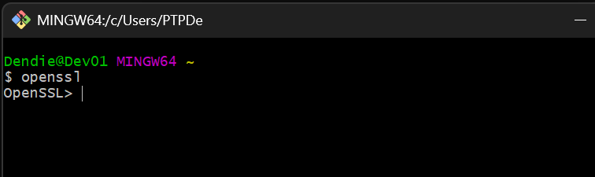

> Pada contoh di atas perintah diketik `openssl` (di screenshot tertulis `openss1` — typo satu huruf, yang benar `openssl`), lalu muncul prompt `OpenSSL>`.

---

## 3. Metode A: Membuat Self-Signed Certificate dengan OpenSSL (SAN Support)

### 3.1 Siapkan file konfigurasi `openssl-san.cnf`

Buat file bernama `openssl-san.cnf` (sudah tersedia di repo ini) dengan isi berikut — sesuaikan `CN`, `O`, `OU`, `DNS.*`, dan `IP.*` dengan server Anda:
   ```ini

        [req]
        default_bits       = 2048
        prompt             = no
        default_md         = sha256
        distinguished_name = dn
        req_extensions     = req_ext

        [dn]
        C  = ID
        O  =  PT. Kantor Saya             # Nama organisasi / perusahaan ?
        OU =  Unit IT                     # Unit / Divisi yang mengelola  ?
        CN =  dev01.dendie.local          # FQDN atau hostname utama server database UAT Anda  ?

        [req_ext]
        subjectAltName     = @alt_names
        extendedKeyUsage   = serverAuth

        [alt_names]
        DNS.1 = dev01.dendie.local         # FQDN (Fully Qualified Domain Name) lengkap server UAT SQL Server ?
        DNS.2 = dev01                      # Hostname / Computer Name singkat server UAT ?
        DNS.3 = localhost          
        IP.1  = 127.0.0.1          
        IP.2  = 192.168.50.220             # IP Address statis server UAT SQL Server yang digunakan dalam connection string aplikasi  ?

   ```
   
### 3.2 Generate Private Key + Sertifikat Self-Signed sekaligus
   ```bash
   openssl req -x509 -nodes -days 730 -newkey rsa:4096 -keyout webserver.key -out webserver.crt -config openssl-san.cnf -extensions req_ext
   ```

   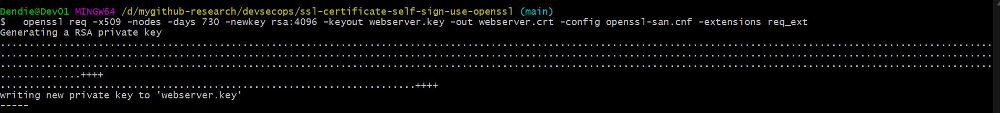

   Perintah di atas menampilkan proses `Generating a RSA private key` dan diakhiri `writing new private key to 'webserver.key'`.

### 3.3 Hasil generate

   Setelah perintah selesai, dua file terbentuk di direktori kerja Anda:

   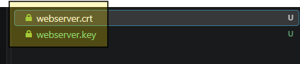

* `webserver.key` → Private Key (RAHASIA).
* `webserver.crt` → Sertifikat publik self-signed yang dipasang di Apache dan diimpor ke client sebagai Root terpercaya.

> Untuk self-signed: file `webserver.crt` ini sekaligus berperan sebagai **domain certificate + trust anchor**. Tidak ada intermediate yang diunduh otomatis — client cukup mengimpor `webserver.crt` ke store **Trusted Root Certification Authorities** (lihat Bab 7). Ciri self-signed: kolom *Issued to* = *Issued by* = `dev01.dendie.local`.

### 3.4 Bedah argumen perintah (breakdown)

Berikut penjelasan tiap argumen:

 ```
openssl req
    Perintah utama OpenSSL untuk mengelola Certificate Request (CSR) dan pembuatan sertifikat X.509.

-x509
    Memberitahu OpenSSL agar tidak membuat CSR, melainkan langsung menerbitkan Sertifikat Self-Signed final secara mandiri (dalam format standar X.509).

-nodes (Singkatan dari No DES)
    Membuat Private Key tanpa menggunakan kata sandi (password).
    Kegunaan: Sangat penting untuk web server seperti Apache atau Nginx agar server bisa restart atau booting secara otomatis tanpa harus meminta pengguna memasukkan password manual setiap kali layanan web dinyalakan.

-days 730
    Menentukan masa aktif/kadaluarsa sertifikat. Angka 730 berarti sertifikat ini akan berlaku selama 2 tahun (730 hari) sejak tanggal dibuat.

-newkey rsa:4096
    Secara otomatis menghasilkan Private Key baru (-newkey) menggunakan algoritma enkripsi RSA dengan panjang kunci (bit length) sebesar 4096 bit.
    Catatan: Ukuran 4096 bit jauh lebih kuat dan aman dibandingkan standar umum 2048 bit.

-keyout webserver.key
    Menentukan nama file dan lokasi penyimpanan untuk Private Key yang baru saja dihasilkan (dalam contoh ini dinamakan webserver.key). File ini rahasia dan jangan sampai bocor ke publik.

-out webserver.crt
    Menentukan nama file dan lokasi penyimpanan untuk Sertifikat Publik yang dihasilkan (dinamakan webserver.crt). File ini nantinya yang akan dipasang di konfigurasi Apache/Nginx dan dibagikan ke klien.

-config openssl-san.cnf
    Menginstruksikan OpenSSL untuk membaca parameter konfigurasi dari file khusus bernama openssl-san.cnf (di mana bagian [alt_names] di dalam file tersebut berisi daftar Domain dan Alamat IP server Anda).

-extensions req_ext
    Mengambil ekstensi tambahan dari dalam file konfigurasi openssl-san.cnf (khususnya bagian req_ext), yang memastikan bahwa ekstensi Subject Alternative Name (SAN) benar-benar dibaca dan disematkan ke dalam sertifikat agar valid untuk IP dan Domain sekaligus.
 ```

---

## 4. Metode B: Integrasi dengan Internal CA Root — contoh Microsoft AD CS (Rekomendasi Korporat)

 ### 4.1 Buat CSR & Private Key

Gunakan file konfigurasi `openssl-san.cnf` yang sama:
   ```bash
   openssl req -new -nodes -keyout webserver.key -out webserver.csr -config openssl-san.cnf
   ```

   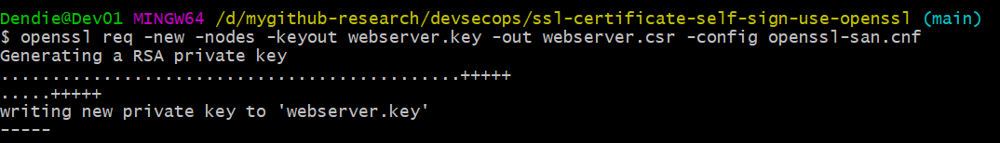

   Setelah selesai, file `webserver.csr` (Certificate Signing Request) akan terhasil di direktori kerja Anda. Buka file tersebut untuk melihat isi CSR-nya (diawali `-----BEGIN CERTIFICATE REQUEST-----`):

   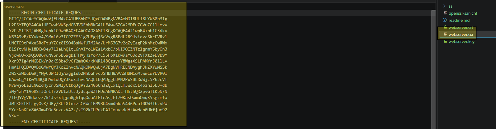

   Perintah `openssl req -new` di atas khusus membuat CSR — dipakai saat Anda ingin sertifikat ditandatangani oleh pihak lain: Public CA (mis. Let's Encrypt, DigiCert) atau CA internal perusahaan (mis. Microsoft AD CS).

### 4.2 Submit CSR ke Microsoft AD CS (topik tambahan — sebelumnya hilang)

1. Buka portal enrolmen AD CS di browser: `http://<nama-server-CA>/certsrv` → **Request a certificate** → **advanced certificate request**.
2. Buka file `webserver.csr` dengan Notepad, salin seluruh isinya (termasuk `-----BEGIN/END CERTIFICATE REQUEST-----`), lalu tempel ke kolom **Saved Request**.
3. Pada **Certificate Template**, pilih template Web Server (mis. `WebServer` / `Subordinate Certification Authority` sesuai kebijakan IT), klik **Submit**.
4. Unduh hasilnya dengan format **Base 64 encoded** → simpan sebagai `webserver.crt` (sertifikat domain yang sudah ditandatangani CA).

### 4.3 File yang Anda terima dari CA

Setelah disetujui, yang Anda terima bukan lagi CSR melainkan **Signed Certificate** + rantai kepercayaannya:

 1. Sertifikat Domain Utama (.crt / .cer / .pem)
    Berisi informasi domain Anda, Public Key Anda, masa aktif sertifikat, serta tanda tangan digital dari pihak CA yang menyatakan bahwa sertifikat ini sah milik Anda.

 2. Sertifikat Rantai Kepercayaan (CA Intermediate CA Root Certificates)
   Menjadi jembatan atau rantai penghubung (chain) antara sertifikat domain Anda dengan Root CA utama yang ada di dalam sistem operasi komputer/browser.

 3. CA Root Certificates    
    Menjadi induk dari segala kepercayaan (trust anchor). Ketika browser mengecek sebuah website, browser akan melacak rantai kepercayaannya ke atas:
---

## 5. Memasang Sertifikat SSL ke Apache Web Server

### 5.1 Salin file sertifikat

Salin `webserver.key` dan `webserver.crt` ke direktori aman, contoh Apache Windows: `C:\Apache24\conf\ssl\`.

### 5.2 Konfigurasi VirtualHost Apache

Konfigurasikan blok Virtual Host di Apache (`httpd-vhosts.conf` atau file sites-available):
   ```apache
   <VirtualHost *:443>  
       ServerName dev01.dendie.local:443
       DocumentRoot "C:/Apache24/htdocs"

       SSLEngine on

       # Path File Sertifikat dan Key
       SSLCertificateFile "C:/Apache24/conf/ssl/webserver.crt"
       SSLCertificateKeyFile "C:/Apache24/conf/ssl/webserver.key"
       
       <Directory "C:/Apache24/htdocs">
           Options Indexes FollowSymLinks
           AllowOverride All
           Require all granted
       </Directory>
   </VirtualHost>
   ```

   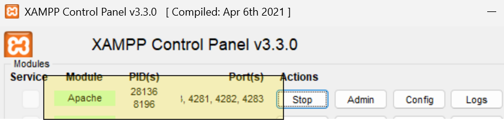

### 5.3 Restart dan pastikan Apache berjalan

Lakukan restart agar konfigurasi SSL dimuat. Restart via **XAMPP Control Panel** (klik Stop lalu Start pada modul Apache), via `services.msc`, atau `httpd -k restart` agar konfigurasi SSL dimuat. Contoh panel dengan Apache berjalan (PID 28136/8196, port 1, 4281, 4282, 4283) — modul Apache berstatus hijau berarti konfigurasi SSL sudah dimuat:

---

## 6. Pointing DNS / Hosts File

Agar domain `dev01.dendie.local` dapat diakses dari client, lakukan salah satu cara berikut:

* **Opsi A (DNS Server Internal):** Jika tersedia DNS Server internal (Windows Server / BIND), buka console **DNS Manager** → *Forward Lookup Zone* → tambahkan **New Host (A)** record:

  | Name (Host) | Fully qualified domain name (FQDN) | IP address |
  | --- | --- | --- |
  | `dev01` | `dev01.dendie.local` | `192.168.50.220` |

  > Koreksi: screenshot ss/8-pointing-dns.png sebenarnya menampilkan edit file hosts (bukan DNS Manager). Lihat Opsi B di bawah.

* **Opsi B (Per Client, tanpa DNS Server):** Edit file `hosts` di setiap client (`C:\Windows\System32\drivers\etc\hosts`) dan tambahkan mapping berikut:

  ```hosts
  192.168.50.220 dev01.dendie.local
  ```

  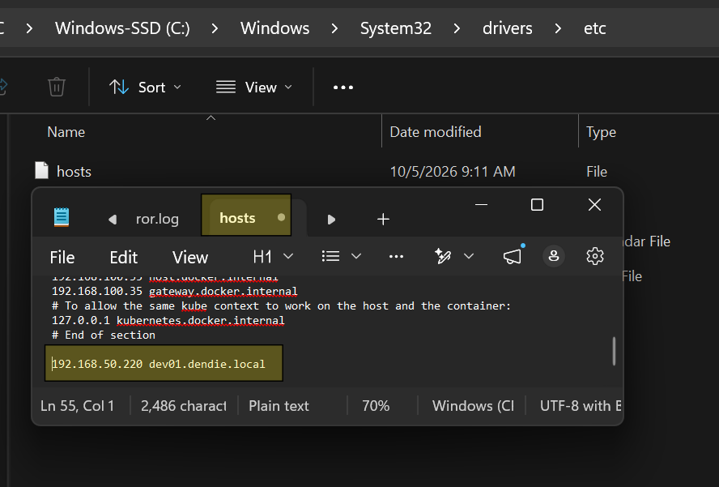

   Setelah menyimpan hosts, flush DNS agar langsung berlaku:

   ``powershell
   ipconfig /flushdns
   ping dev01.dendie.local
   ``

---

## 7. Install Sertifikat (Root CA) di Client / Browser

Karena sertifikat ini bersifat **self-signed** (dibuat sendiri, bukan oleh Public CA), sertifikat root-nya **harus diimpor manual** ke setiap client agar browser tidak menampilkan peringatan "Not Secure".

1. Salin file `webserver.crt` ke komputer client.
2. Klik dua kali file `webserver.crt` → klik **Install Certificate...** → pilih **Local Machine** → klik **Next**:

   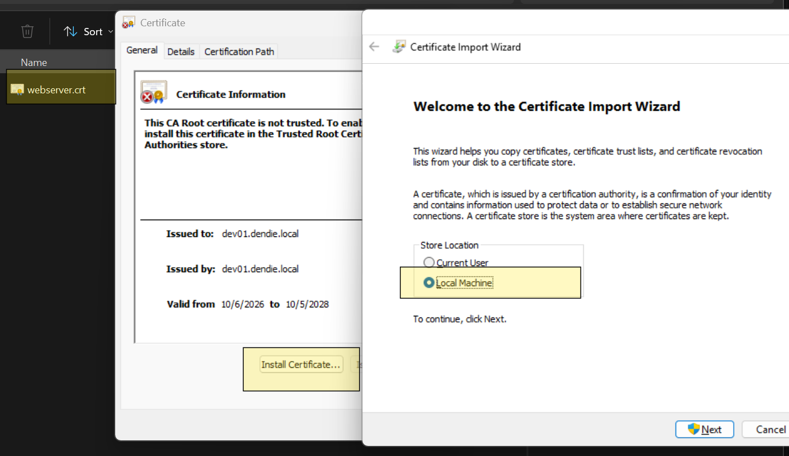

3. Pilih **Place all certificates in the following store**, klik **Browse...**, lalu pilih **Trusted Root Certification Authorities** → **OK** → **Next** → **Finish**:

   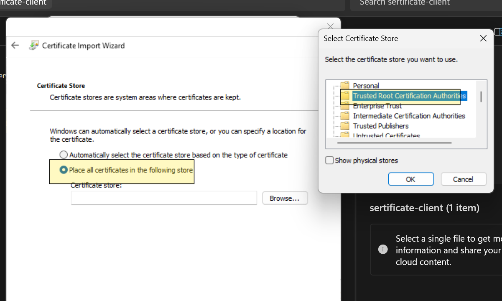

> Screenshot juga memperlihatkan tab General sebelum impor: Issued to = dev01.dendie.local, Issued by = dev01.dendie.local (ciri self-signed), Valid from 10/6/2026 to 10/5/2028, status This CA Root certificate is not trusted.

4. Jika muncul peringatan keamanan, klik **Yes** untuk melanjutkan proses import.

> **Catatan:** Ulangi langkah ini di setiap komputer client yang ingin mengakses `https://dev01.dendie.local`.

---

## 8. Pengujian & Verifikasi
Buka browser pada komputer klien yang terhubung ke jaringan/domain, lalu akses URL `https://dev01.dendie.local`. Jika sertifikat sudah terpasang dan Root CA sudah diimpor, browser akan menampilkan indikator aman (gembok hijau) tanpa peringatan keamanan.

### 8.1 Cek Detail Sertifikat (Tab *Umum*)

Klik ikon gembok/tombol *View certificate* di address bar browser → tab **Umum**. Pastikan:

* **Diterbitkan Untuk:** `CN = dev01.dendie.local`
* **Diterbitkan Oleh:** sama dengan *Diterbitkan Untuk* (ciri khas sertifikat self-signed)
* **Periode Validitas:** 06 Okt 2026 - 05 Okt 2028 (730 hari, sesuai contoh screenshot)
* **Sidik Jari SHA-256:** cocokkan fingerprint Sertifikat dan Kunci Publik dengan output OpenSSL (lihat Bab 8.3)

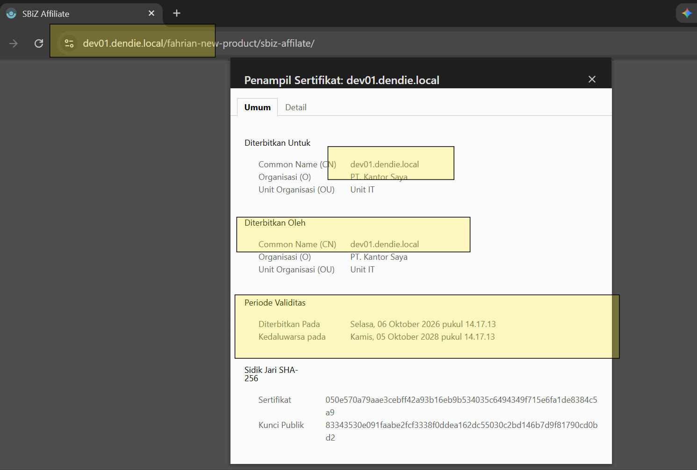

### 8.2 Cek Hierarki Sertifikat (Tab *Detail*)

Pada tab **Detail**, cek bagian **Hierarki Sertifikat**:

* Jika Root CA sudah terpasang dengan benar di client, hierarki akan menampilkan rantai kepercayaan (mis. `dev01.dendie.local` → *Trusted Root Certification Authorities*).
* Jika Root CA **belum** diinstall di client, hierarki hanya menampilkan sertifikat itu sendiri.

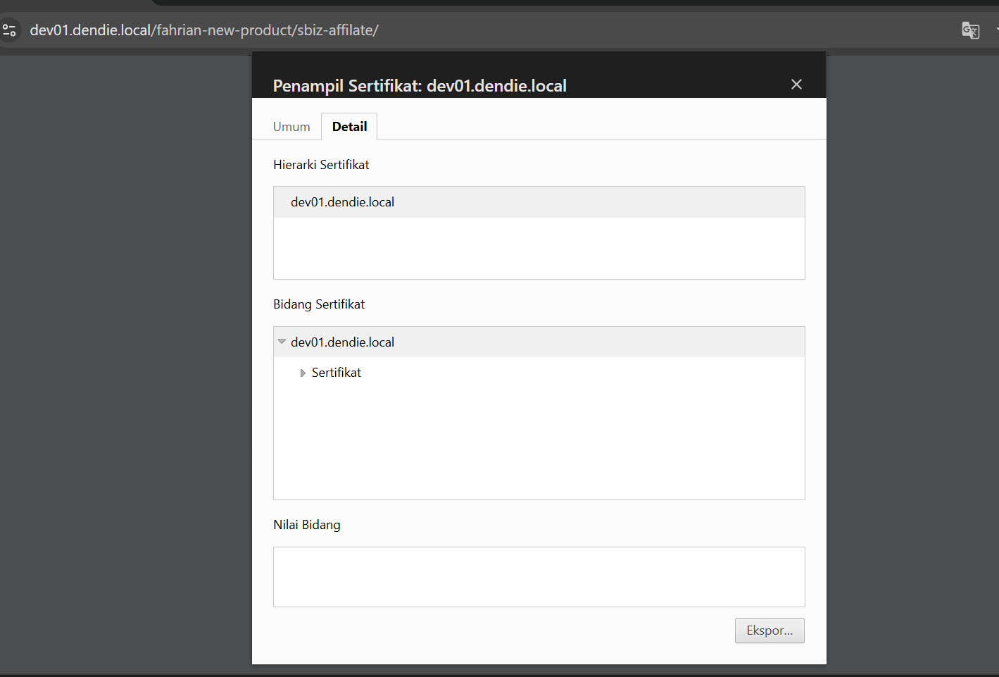

---

### 8.3 Verifikasi via OpenSSL (topik tambahan - sebelumnya hilang)

Cek SAN, masa berlaku, dan fingerprint langsung dari file:

```bash
openssl x509 -in webserver.crt -noout -subject -issuer -dates
openssl x509 -in webserver.crt -noout -ext subjectAltName
openssl x509 -in webserver.crt -noout -fingerprint -sha256
openssl s_client -connect dev01.dendie.local:443 -servername dev01.dendie.local -showcerts
```

## 9. Troubleshooting Umum

| Gejala | Penyebab | Solusi |
| --- | --- | --- |
| Browser menampilkan *"Your connection is not private"* / *"Not Secure"* | Root CA belum diimport ke client | Ulangi langkah pada [Bagian 7](#7-install-sertifikat-root-ca-di-client--browser) |
| Domain tidak ditemukan / ERR_NAME_NOT_RESOLVED | DNS/hosts belum di-pointing | Ulangi langkah pada [Bagian 6](#6-pointing-dns--hosts-file) |
| `ERR_SSL_PROTOCOL_ERROR` / Apache gagal start | Modul `mod_ssl` belum aktif atau konfigurasi vhost salah | Aktifkan `mod_ssl`, cek log error Apache |
| Peringatan pada browser tetap muncul walau Root CA sudah diimport | Import dilakukan ke store yang salah | Pastikan memilih store **Trusted Root Certification Authorities**, bukan *Personal* |
| *Name mismatch* pada browser | Domain tidak cocok dengan `CN`/`subjectAltName` | Pastikan domain/tercantum di bagian `[alt_names]` pada `openssl-san.cnf` |

---

## 10. Keamanan Private Key (Best Practice)

* File `webserver.key` **tidak boleh** dibagikan / di-commit ke Git. Pastikan sudah masuk ke `.gitignore`:
  ```gitignore
  *.key
  *.csr
  ```
* Set file key hanya bisa dibaca oleh service account Apache:
  ```bash
  chmod 600 webserver.key
  ```
* Jangan simpan Private Key bersamaan dengan sertifikat pada direktori yang bisa diakses publik (`htdocs`/`DocumentRoot`).
* Gunakan masa aktif yang wajar (mis. 730 hari) dan lakukan rotasi/re-issue sebelum sertifikat kedaluwarsa.

---

## 11. Lampiran: Arsitektur & Struktur Berkas

### Arsitektur

Diagram arsitektur alur penerbitan dan pemasangan sertifikat SSL tersedia di [`design/design.drawio`](design/design.drawio) (buka menggunakan [draw.io](https://app.diagrams.net/)).

### Struktur Berkas Repositori

```
ssl-certificate-self-sign-use-openssl/
├── readme.md                  # Dokumentasi (file ini)
├── openssl-san.cnf            # Konfigurasi OpenSSL (SAN untuk Domain & IP)
├── webserver.key              # Private Key (RAHASIA - jangan dibagikan)
├── webserver.crt              # Sertifikat Self-Signed
├── webserver.csr              # Certificate Signing Request (untuk Metode B / Internal CA)
├── design/
│   └── design.drawio          # Diagram arsitektur
└── ss/                        # Screenshot/langkah-langkah visual
    ├── 1-cek-openssl.png
    ├── 2-generate-private-key-domain-ceritifiate.png
    ├── 3-generate-private-key-domain-ceritifiate-result.png
    ├── 4-generate-csr-for-internal-ca-root.png
    ├── 5-generate-csr-for-internal-ca-root-root-file-csr.png
    ├── 7-memasang-sertifikat-SSL-ke-Apache-Web-Server.png
    ├── 8-pointing-dns.png
    ├── 9-install-ca-di-client.png
    ├── 10-install-ca-di-client-2.png
    ├── 11-install-ca-di-client-cek-valid.png
    └── 12-install-ca-di-client-cek-valid-2.png
```
